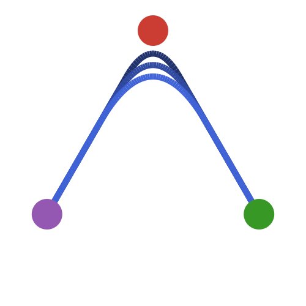

[](https://codecov.io/gh/SouthEndmusic/SmoothInterpolation.jl)
[](https://southendmusic.github.io/SmoothInterpolation.jl/dev/)



# SmoothInterpolation.jl

`SmoothInterpolation.jl` exports 3 interpolation types in the style of [DataInterpolations.jl](https://github.com/SciML/DataInterpolations.jl):

- `SmoothedLinearInterpolation`, a type of linear interpolation with well-behaved smoothed corners;
- `SmoothedLinearInterpolationIntInv`, the inverse of the antiderivative of a `SmoothedLinearInterpolation` if it exists;
- `LinearInterpolationInvInv`, the inverse of the antiderivative of a `LinearInterpolation` if it exists.

## Installation

Currently you can only install as below.

```
pkg> dev https://github.com/SouthEndMusic/SmoothInterpolation.jl
```

## Supported features

Not all features for interpolation objects from `DataInterpolations.jl` are currently supported.

|                                     | Evaluation | Derivative    | Integration                                |
| ----------------------------------- | ---------- | ------------- | ------------------------------------------ |
| `SmoothedLinearInterpolation`       | Supported  | supported     | Supported                                  |
| `SmoothedLinearInterpolationIntInv` | Supported  | supported     | Not supported                              |
| `LinearInterpolationIntInv`         | Supported  | supported     | Not supported                              |

If you wish to use one of the currently unsupported features, please [write an issue](https://github.com/SouthEndMusic/SmoothInterpolation.jl/issues). Note that differentiation can also be achieved with many of the [automatic differentiation packages](https://juliadiff.org/#the_big_list) in the Julia ecosystem.

## Logo

The logo is inspired by the [julia logo graphics](https://github.com/JuliaLang/julia-logo-graphics).
